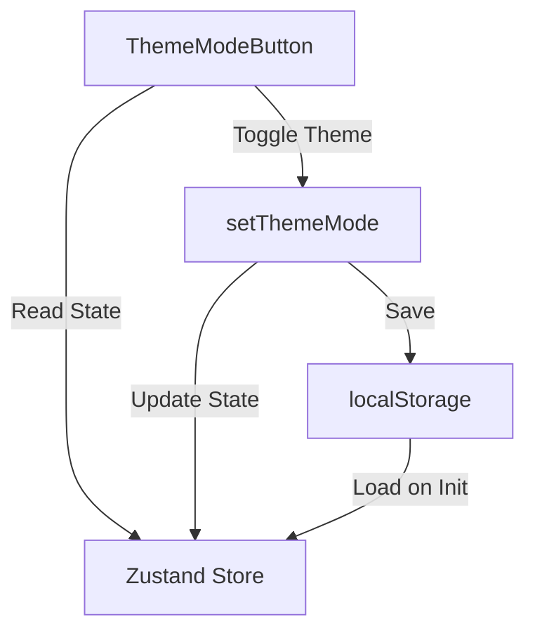

# Theme Mode Toggle Documentation

## Overview
The theme mode toggle functionality is implemented using a Zustand store (`useAppStore`) and a React component (`ThemeModeButton`). This system allows users to switch between light and dark themes, with persistence across browser sessions.

## Components

### ThemeModeButton Component
```tsx
const ThemeModeButton: React.FC = () => {
  const { themeMode, setThemeMode } = useAppStore();
  return (
    <button className="text-xl" onClick={() => setThemeMode()}>
      {themeMode === 'dark' ? '☀️' : '🌙'}
    </button>
  );
}
```
- Renders a button with an emoji (☀️ for dark mode, 🌙 for light mode)
- Uses Zustand store to access and modify theme state

### Store Implementation (useAppStore)
```typescript
interface AppState {
  themeMode: 'light' | 'dark';
  setThemeMode: () => void;
  // ...other state properties
}
```

## Data Flow

1. **Initial Load**
   - Store initializes with `light` theme as default
   - `initApp()` checks localStorage for saved theme preference
   - If found, updates store state with saved preference

2. **Theme Toggle**
   - User clicks button → triggers `setThemeMode()`
   - `setThemeMode` function:
     - Toggles between 'light' and 'dark'
     - Saves new value to localStorage
     - Updates Zustand store state

3. **State Persistence**
   ```typescript
   setThemeMode: () => set((state: AppState) => {
     const newTheme = state.themeMode === 'light' ? 'dark' : 'light';
     localStorage.setItem('themeMode', newTheme);
     return { ...state, themeMode: newTheme }
   })
   ```

## Data Flow Diagram
